Reference Guide - Import XML to Teradata Tool
 
 
Table of Contents
==================

[Preface](#preface)

[Overview](#overview)

[Target Audience](#target-audience)

[Target Database](#target-database)

[Implementation Environment](#implementation-environment)

[About this document](#about-this-document)

[Important Notes](#important-notes)

[Security](#security)

[Prerequisites](#prerequisites)

[Host Setup](#host-setup)

[End-User Setup](#end-user-setup)

[Accounts and Connections](#accounts-and-connections)

[Teradata](#teradata)

[Deployment Setup](#deployment-setup)

[Running the tool](#running-the-tool)

[Execution Lifecycle](#execution-lifecycle)

[Sample Run](#sample-run)

[Logs](#logs)

[Run-time Log 13](#_Toc509955299)

[BTEQ Out files 14](#_Toc509955300)

[Summary Log 15](#_Toc509955301)

Preface
=======

Overview
--------

This document presents a guide on how to use the tool: import from XML
to Teradata.

The tool is based from [Python](https://www.python.org/) 3.6.4.
Developed using [Visual Studio
Code](https://github.com/Microsoft/vscode) with Python extension.

SQL scripts are created using Teradata Studio.

Target Audience
---------------

The reader has basic knowledge on the following:

-   Python

-   SQL

-   PowerShell

Target Database
---------------

-   The tool has been tested on a Teradata database version 15.10

Implementation Environment
--------------------------

This guide is intended on these environments:

-   Developmet and production

-   Self-service or local sandbox

-   Proof of Concept scenarios

Important Notes
===============

Security
--------

-   Secure the file ./scripts/logon as it contains credentials on how to
    connect to Teradata database

Prerequisites
=============

Host Setup
----------

-   User with administrator privileges. Required to install apps

-   Apps and Python Modules:

    -   Python 3.6.4 or later\
        <https://www.python.org/>

    -   lxml python module to parse XML files\
        <https://pypi.python.org/pypi/lxml>

    -   xmlschema python module to validate XML files using XSD schema\
        <https://pypi.python.org/pypi/xmlschema>

    -   pyodbc python module to check Teradata connection via ODBC\
        <https://pypi.python.org/pypi/pyodbc>

    -   PowerShell 4.0 or later for running BTEQ commands\
        <https://github.com/PowerShell/PowerShell>

    -   Teradata BTEQ (part of Teradata Tools and Utilities) 15.10 for
        running BTEQ commands\
        <https://developer.teradata.com>

-   Database

    -   Teradata 15.10\
        <https://www.teradata.com>

    -   Teradata ODBC Connection

-   Project directory. This is where all scripts and data files are
    stored

End-User Setup
--------------

-   Script editor for opening/modifying python scripts like: PyCharm,
    Atom, and Visual Studio Code with Python extension

-   Teradata Studio or SQL Assistant for running Teradata SQL commands

-   Teradata BTEQ and Teradata ODBC Connection

Accounts and Connections
========================

Note that the credentials, connections and Teradata object names used in
this document is for demo purposes only. Please use appropriate values
based from your target environment.

**NOTE: To secure the server, provide a strong password**

Teradata
--------

| Property               | Value
| ---------------------- | -------------
| Hostname               | < host name >
| IP Address or DNS      | < Teradata server IP address or DNS >

| USERNAME        | DEFAULT PASSWORD        | DESCRIPTION
| --------------- | ----------------------- | -----------
| < username >    | < **strong password** > | Teradata account

Deployment Setup
================

-   Place these python files in the root (project) folder

    -   importXmlToTD.py (this is the main script that imports XML files
        to Teradata tables)

    -   classdef.py (supporting module where the main script is being
        referenced at run-time)

-   These folders must be present at run-time

    -   archive - contains processed XML sources files

    -   logs - contains two (2) types of log files:

        -   \<date\>\_\<time\>\_importXmlToTD.py.log (execution log of
            the python script)\
            e.g. 20180324\_135213\_importXmlToTD.py.log

        -   \<date\>\_\<time\>\_\<action\>\_\<script\_name\>.btq.out
            (BTEQ output files)\
            e.g.
            20180324\_135238\_loadtostg\_FILENAME.XML.Insert\_STG.btq.out

    -   reject - contains invalid XML source files

    -   scripts - contains BTEQ scripts and XSD files for validating
        XML source files

    -   src - contains XML sources and a text file that contains
        currently processed source files

    -   tgt - contains CSV files parsed from XML source files. These
        CSV files are temporary files and are always removed by the tool

<!-- -->

-   Create a Teradata 15.10 ODBC Data Source Name (DSN) connection. This
    will only be used to check if there is an active connection to
    Teradata database.

-   Run the DDL.sql script under ./scripts folder. This will create the
    landing, staging and log tables.

-   Open logon file under ./scripts folder and provide information on
    how to access the Teradata database server

-   Open all BTEQ scripts under ./scripts folder and validate if the
    correct database name is being used.

Running the tool
================

1.  Open a command prompt: **cmd** window or **PowerShell**

2.  Type **python importXmlToTD.py**

3.  Press **Enter**

Execution Lifecycle
===================

Below is the high-level view of the tool during run-time

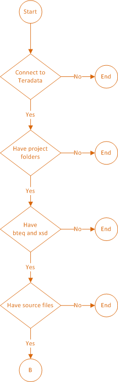

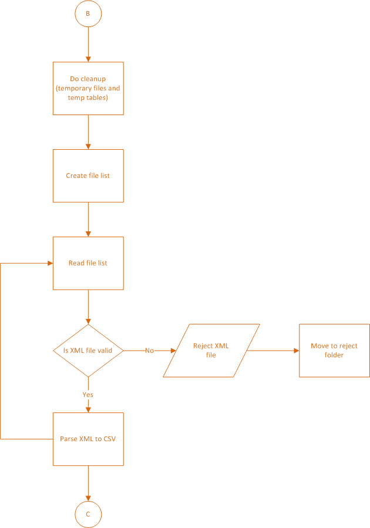

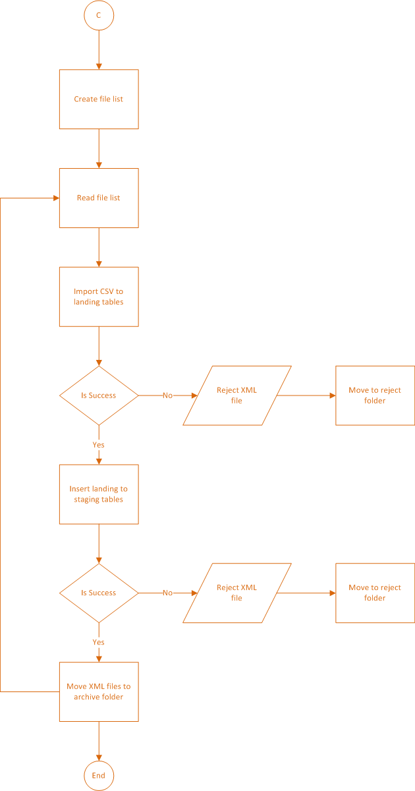

Sample Run
==========

-   Source files:\
    \
    

    -   2 valid XML files

    -   1 invalid XML file

-   Steps

1.  Open **PowerShell** window

2.  Type **python importXmlToTD.py** and press **Enter**\
    \
    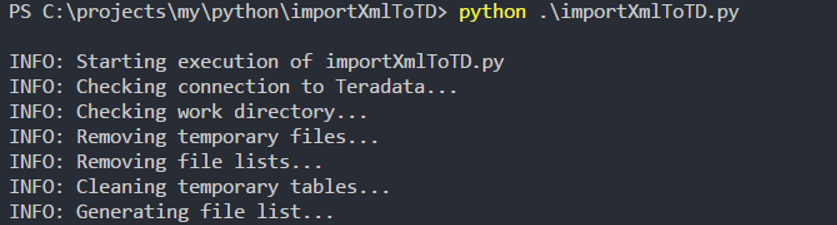

3.  The tool will validate the XML source files\
    \
    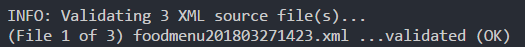

4.  XML files that do not conform with the XSD specification will show a
    warning status\
    \
    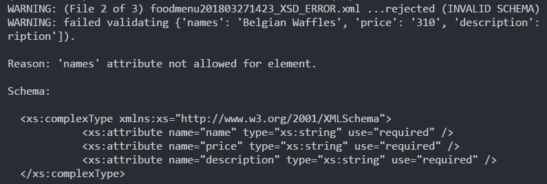

5.  Presenting output summary of XML validation step\
    \
    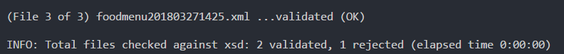

> At this point, the script will move invalid source files to ./reject
> folder; it will change the name of the rejected files with date and
> time.
>
> 
>
> Also, it will refresh the file list in preparation for the next step.

6.  The script will parse (read) the XML files, extract the data and
    save to CSV files.

> Example shows data being extracted per XML attribute
>
> 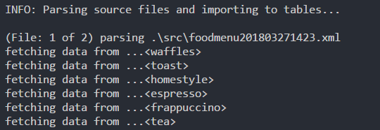
>
> XML source files that do not have data are omitted.

7.  Once the CSV file has been created, the script will import the
    content to Teradata landing tables and insert to staging tables by
    running a BTEQ script via PowerShell

> 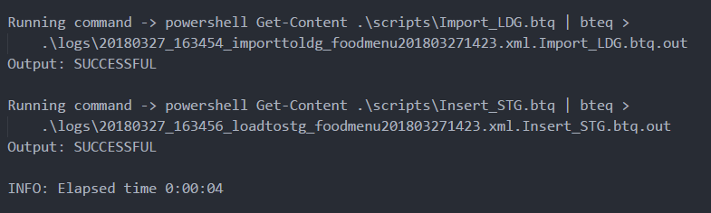
>
> On unsuccessful execution, the script will move the XML source file to
> ./reject folder; it will change the name of the rejected files with
> date and time.

8.  The script will repeat steps 6-7 until all valid XML files has been
    processed.

9.  Once done, the script will move successfully processed XML files to
    archive folder.

> 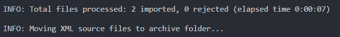

10. Before the end of execution, the script will present the summary
    statistics and total run-time.

> 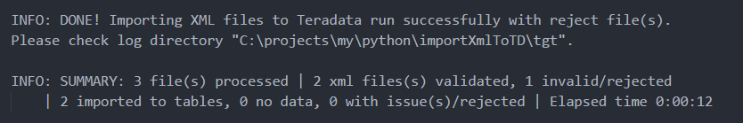

Logs
====

The tool is designed to generate logs at run-time. These will help
diagnose issues produced by errors.

Log files are saved in the ./log directory. Log file names contains the
date and time where the tool and/or a BTEQ script is run.

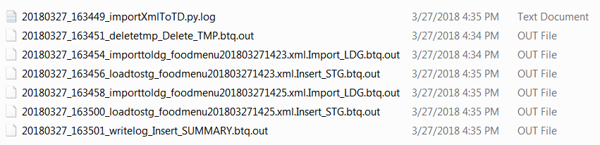

[]{#_Toc509955299 .anchor}

Run-time Log
------------

This log is produced at run-time. It writes each process that the script
is doing. The information it presents is almost the same as the output
window:

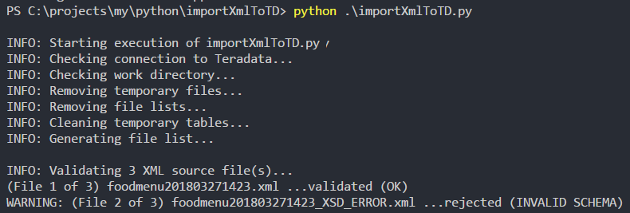\
Output Window

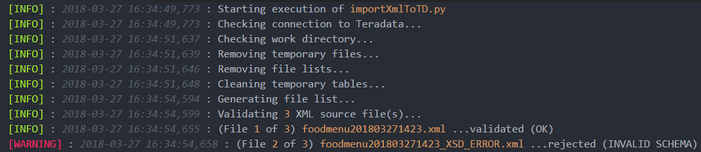\
Log file

[]{#_Toc509955300 .anchor}

BTEQ Out files
--------------

These are log files generated while running a BTEQ script.

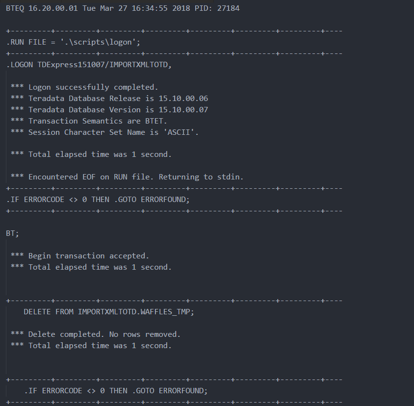

Each BTEQ call has its own out file.

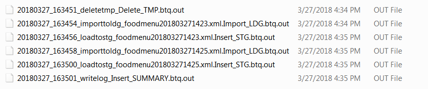

[]{#_Toc509955301 .anchor}

Summary Log
-----------

This is a table record entry of the summary log statistics.

**SELECT** **TOP** 1 \*

**FROM** XMLTOTD\_SUMMARY

**ORDER** **BY** START\_DATETIME **DESC**;

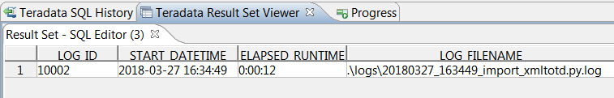

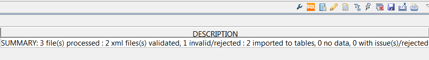
